# CDM, DRR & Smart Contract Maturity: JPM vs Citi vs BofA

## Tier-1 U.S. Banks Technology Adoption Comparison

```mermaid
%%{init: {'theme':'base', 'themeVariables': { 'primaryColor':'#0d47a1','primaryTextColor':'#fff','primaryBorderColor':'#1976d2','lineColor':'#1976d2','secondaryColor':'#4caf50','tertiaryColor':'#ff9800','noteBkgColor':'#fff3e0','noteTextColor':'#000'}}}%%

flowchart TB
    subgraph Legend["<b>Maturity Levels</b>"]
        L1["🟢 Production/Operational"]
        L2["🟡 Active Development/Testing"]
        L3["🔴 No Public Disclosure"]
        L4["⚪ Aspirational/Early Stage"]
    end

    subgraph JPM["<b>JPMorgan Chase</b><br/>🏆 Industry Leader"]
        JPM_CDM["<b>CDM Implementation</b><br/>🟢 OPERATIONAL<br/>First major U.S. bank<br/>Multiple jurisdictions live<br/>FINOS Adoption Award 2024"]
        JPM_DRR["<b>DRR Deployment</b><br/>🟢 PRODUCTION<br/>Primary reporting mechanism<br/>ASIC & MAS live<br/>~50% cost reduction"]
        JPM_SC["<b>Smart Contracts</b><br/>🟡 FOUNDATION READY<br/>Kinexys platform: $1.5T+<br/>Tokenized Collateral Network<br/>CDM groundwork complete"]
    end

    subgraph CITI["<b>Citigroup</b><br/>❓ Status Unknown"]
        CITI_CDM["<b>CDM Implementation</b><br/>🔴 NO PUBLIC INFO<br/>ISDA member<br/>Strategy undisclosed"]
        CITI_DRR["<b>DRR Deployment</b><br/>🔴 NO PUBLIC INFO<br/>Timeline unclear<br/>No announcements found"]
        CITI_SC["<b>Smart Contracts</b><br/>🔴 NO PUBLIC INFO<br/>No disclosed initiatives"]
    end

    subgraph BOFA["<b>Bank of America</b><br/>⚠️ Potential Resource Diversion"]
        BOFA_CDM["<b>CDM Implementation</b><br/>🔴 NO PUBLIC INFO<br/>ISDA member<br/>$3.8B tech spend 2023<br/>OCC order Dec 2024"]
        BOFA_DRR["<b>DRR Deployment</b><br/>🔴 NO PUBLIC INFO<br/>No public disclosures<br/>Possible resource diversion"]
        BOFA_SC["<b>Smart Contracts</b><br/>🔴 NO PUBLIC INFO<br/>Blockchain exploration noted<br/>No derivatives initiatives"]
    end

    style JPM fill:#e8f5e9,stroke:#2e7d32,stroke-width:3px,color:#000
    style CITI fill:#fff3e0,stroke:#f57c00,stroke-width:2px,color:#000
    style BOFA fill:#ffebee,stroke:#c62828,stroke-width:2px,color:#000
    style Legend fill:#e3f2fd,stroke:#1565c0,stroke-width:2px
    
    style JPM_CDM fill:#c8e6c9,stroke:#388e3c,stroke-width:2px,color:#000
    style JPM_DRR fill:#c8e6c9,stroke:#388e3c,stroke-width:2px,color:#000
    style JPM_SC fill:#fff9c4,stroke:#f9a825,stroke-width:2px,color:#000
    
    style CITI_CDM fill:#ffccbc,stroke:#d84315,stroke-width:2px,color:#000
    style CITI_DRR fill:#ffccbc,stroke:#d84315,stroke-width:2px,color:#000
    style CITI_SC fill:#ffccbc,stroke:#d84315,stroke-width:2px,color:#000
    
    style BOFA_CDM fill:#ffccbc,stroke:#d84315,stroke-width:2px,color:#000
    style BOFA_DRR fill:#ffccbc,stroke:#d84315,stroke-width:2px,color:#000
    style BOFA_SC fill:#ffccbc,stroke:#d84315,stroke-width:2px,color:#000
```

---

## Key Consensus Findings

---

## Competitive Positioning Analysis

---

## Technology Stack Maturity Comparison

| Bank | CDM Status | DRR Status | Smart Contracts | Competitive Position |
|------|-----------|-----------|-----------------|---------------------|
| **JPMorgan** | 🟢 Production (Multiple Jurisdictions) | 🟢 Primary Mechanism | 🟡 Foundation Complete (Kinexys) | **First Mover Advantage** |
| **Citigroup** | 🔴 Undisclosed | 🔴 Undisclosed | 🔴 Undisclosed | **Information Gap** |
| **Bank of America** | 🔴 Undisclosed | 🔴 Undisclosed | 🔴 Undisclosed | **Potential Lag + OCC Order** |

---

## Strategic Implications

---

## DRR as Industry Catalyst

---

## Summary: Consensus Points

### ✅ **JPMorgan Chase**
- **Only major U.S. bank** with publicly operational CDM/DRR
- Production deployment across multiple jurisdictions (ASIC, MAS)
- FINOS "Adoption Achiever" award 2024
- Kinexys platform: $1.5T+ transactions processed
- Smart contract foundation complete

### ❓ **Citigroup**
- ISDA member with regulatory obligations
- **Zero public disclosures** on CDM/DRR timeline
- Strategy and implementation status unknown
- Competitive divergence risk

### ⚠️ **Bank of America**
- ISDA member, $3.8B technology investment (2023)
- **No public CDM/DRR announcements** found
- OCC cease-and-desist order (Dec 2024) for BSA/sanctions compliance
- Likely resource diversion affecting technology priorities
- Potential competitive lag

---

**Data Source**: Multi-LLM synthesis (CLAUDE, GEMINI, GPT) | **Analysis Date**: November 2025
